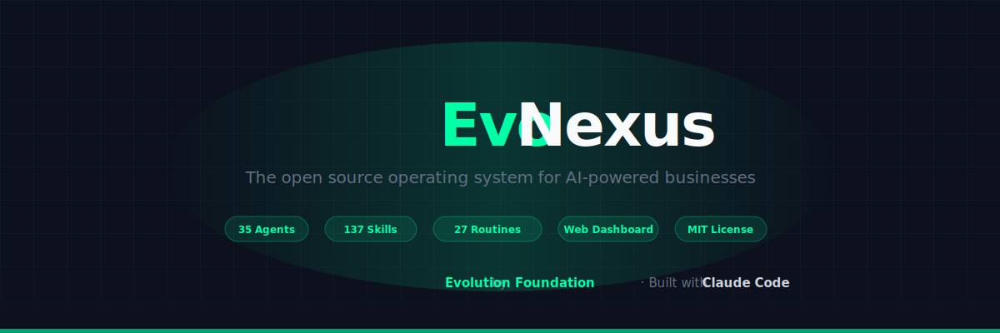

<p align="center">
  <a href="https://evolutionfoundation.com.br">
    
  </a>
</p>

<p align="center">
  
</p>

<p align="center">
  <a href="#quick-start">Quick Start</a> •
  <a href="#web-dashboard">Dashboard</a> •
  <a href="docs/getting-started.md">Docs</a> •
  <a href="CHANGELOG.md">Changelog</a> •
  <a href="CONTRIBUTING.md">Contributing</a> •
  <a href="LICENSE">MIT License</a>
</p>

---

> **Disclaimer:** EvoNexus is an independent, **unofficial open-source project**. It is **not affiliated with, endorsed by, or sponsored by Anthropic**. "Claude" and "Claude Code" are trademarks of Anthropic, PBC. This project integrates with Claude Code as a third-party tool and requires users to provide their own installation and credentials.

---

## What It Is

EvoNexus is an open source, **unofficial** toolkit compatible with [Claude Code](https://docs.anthropic.com/en/docs/claude-code) and other LLM tooling. It is designed to integrate with Claude Code capabilities: native agents, skills, slash commands, MCP integrations, and the Claude CLI.

It turns a single Claude Code installation into a team of **35 specialized agents** organized in two ortogonal layers — **16 business agents** (operations, finance, community, marketing, HR, legal, product, data) and **19 engineering agents** (architecture, planning, code review, testing, debugging, security, design — derived from [oh-my-claudecode](https://github.com/yeachan-heo/oh-my-claudecode), MIT, by Yeachan Heo). Each agent has its own domain, skills, persistent memory, and automated routines. The result is a production system that runs daily operations for a founder/CEO **and** supports software development workflows: from morning briefings to financial reports, community monitoring, social analytics, end-of-day consolidation, plus architectural reviews, code audits, and verified implementation pipelines.

**This is not a chatbot.** It is a real operating layer that runs routines, generates HTML reports, syncs meetings, triages emails, monitors community health, tracks financial metrics, and consolidates everything into a unified dashboard — all automated.

### Why Claude Code?

- **Native agent system** — agents are `.md` files with system prompts, not code
- **Skills as instructions** — teach Claude new capabilities via markdown, not plugins
- **MCP integrations** — first-class support for Google Calendar, Gmail, GitHub, Linear, Telegram, and more
- **Slash commands** — `/clawdia`, `/flux`, `/pulse` invoke agents directly
- **Persistent memory** — CLAUDE.md + per-agent memory survives across sessions
- **CLI-first** — runs anywhere Claude Code runs (terminal, VS Code, JetBrains, web)

---

## Key Features

- **16 Core Agents + Custom** — Ops, Finance, Projects, Community, Social, Strategy, Sales, Courses, Personal, Knowledge, Marketing, HR, Customer Success, Legal, Product, Data — plus user-created `custom-*` agents (gitignored)
- **~130 Skills + Custom** — organized by domain prefix (`social-`, `fin-`, `int-`, `prod-`, `mkt-`, `gog-`, `obs-`, `discord-`, `pulse-`, `sage-`, `hr-`, `legal-`, `ops-`, `cs-`, `data-`, `pm-`)
- **7 Core + 20 Custom Routines** — daily, weekly, and monthly ADWs managed by a scheduler (core routines ship with the repo; custom routines are user-created and gitignored)
- **Web Dashboard** — React + Flask app with auth, roles, web terminal, service management
- **17 Integrations** — Google Calendar, Gmail, Linear, GitHub, Discord, Telegram, Stripe, Omie, Fathom, Todoist, YouTube, Instagram, LinkedIn, Evolution API, Evolution Go, Evo CRM, and more
- **2 core + custom HTML report templates** — dark-themed dashboards for every domain
- **Persistent Memory** — two-tier system (CLAUDE.md + memory/) with LLM Wiki pattern: ingest propagation, weekly lint, centralized index, and operation log
- **Knowledge Base** — optional semantic search via [MemPalace](https://github.com/milla-jovovich/mempalace) (local ChromaDB vectors, one-click install)
- **Full Observability** — JSONL logs, execution metrics, cost tracking per routine

---

## Screenshots

<p align="center">
  
  
</p>
<p align="center">
  
  
</p>

---

## Integrations

Connect your existing tools via MCP servers, API clients, or OAuth:

| Integration | Type | What it does |
|---|---|---|
| **Google Calendar** | MCP | Read/create/update events, find free time |
| **Gmail** | MCP | Read, draft, send emails, triage inbox |
| **GitHub** | MCP + CLI | PRs, issues, releases, code search |
| **Linear** | MCP | Issues, sprints, project tracking |
| **Discord** | API | Community messages, channels, moderation |
| **Telegram** | MCP + Bot | Notifications, messages, commands |
| **Stripe** | API | Charges, subscriptions, MRR, customers |
| **Omie** | API | ERP — clients, invoices, financials, stock |
| **Fathom** | API | Meeting recordings, transcripts, summaries |
| **Todoist** | CLI | Task management, priorities, projects |
| **YouTube** | OAuth | Channel stats, videos, engagement |
| **Instagram** | OAuth | Profile, posts, engagement, insights |
| **LinkedIn** | OAuth | Profile, org stats |
| **Canva** | MCP | Design and presentations |
| **Notion** | MCP | Knowledge base, pages, databases |
| **Obsidian** | CLI | Vault management, notes, search |
| **Evolution API** | API | WhatsApp messaging — instances, messages, chats, groups |
| **Evolution Go** | API | WhatsApp messaging (Go implementation) |
| **Evo CRM** | API | AI-powered CRM — contacts, conversations, pipelines |

Social media accounts (YouTube, Instagram, LinkedIn) are connected via OAuth through the dashboard.

---

## Prerequisites

| Tool | Required | Install |
|------|----------|---------|
| **Claude Code** | Yes | `npm install -g @anthropic-ai/claude-code` ([docs](https://claude.ai/download)) |
| **Python 3.11+** | Yes | via [uv](https://docs.astral.sh/uv/): `curl -LsSf https://astral.sh/uv/install.sh \| sh` |
| **Node.js 18+** | Yes | [nodejs.org](https://nodejs.org) |
| **uv** | Yes | `curl -LsSf https://astral.sh/uv/install.sh \| sh` |

The setup wizard (`make setup`) checks for all prerequisites before proceeding.

---

## Quick Start

### Method 1 — One command (recommended)

```bash
npx @evoapi/evo-nexus
```

This downloads and runs the interactive setup wizard automatically.

### Method 2 — Manual clone

```bash
git clone https://github.com/EvolutionAPI/evo-nexus.git
cd evo-nexus

# Interactive setup wizard — checks prerequisites, creates config files
make setup
```

### What the wizard does

The wizard:
- Checks that Claude Code, uv, Node.js are installed
- Asks for your name, company, timezone, language
- Lets you pick which agents and integrations to enable
- Generates `config/workspace.yaml`, `.env`, `CLAUDE.md`, and workspace folders
- Builds the dashboard frontend

### 2. Configure API keys

```bash
nano .env
```

Add keys for the integrations you enabled. Common ones:

```env
# Discord (for community monitoring)
DISCORD_BOT_TOKEN=your_token
DISCORD_GUILD_ID=your_guild_id

# Stripe (for financial routines)
STRIPE_SECRET_KEY=sk_live_...

# Telegram (for notifications)
TELEGRAM_BOT_TOKEN=your_token
TELEGRAM_CHAT_ID=your_chat_id

# Social media (connect via dashboard Integrations page)
SOCIAL_YOUTUBE_1_API_KEY=...
SOCIAL_INSTAGRAM_1_ACCESS_TOKEN=...
```

See `.env.example` for all available variables.

### 3. Start the dashboard

```bash
make dashboard-app
```

Open **http://localhost:8080** — the first run shows a setup wizard where you:
- Configure your workspace (name, company, agents, integrations)
- Create your admin account
- License is activated automatically in the background

### 4. Start automated routines

```bash
make scheduler
```

Runs all enabled routines on schedule (morning briefing, email triage, community pulse, financial reports, etc). Configure schedules in `config/routines.yaml`.

### 5. Use Claude Code

Open Claude Code in the project directory — it reads `CLAUDE.md` automatically.

```bash
# Use slash commands to invoke agents
/clawdia       # Ops — agenda, emails, tasks, decisions
/flux          # Finance — Stripe, ERP, cash flow, reports
/atlas         # Projects — Linear, GitHub, sprints, milestones
/pulse         # Community — Discord, WhatsApp, sentiment, FAQ
/pixel         # Social media — content, calendar, analytics
/sage          # Strategy — OKRs, roadmap, competitive analysis
/nex           # Sales — pipeline, proposals, qualification
/mentor        # Courses — learning paths, modules
/kai           # Personal — health, habits, routine
/oracle        # Knowledge — workspace docs, how-to, configuration
/mako          # Marketing — campaigns, content, SEO, brand
/aria          # HR — recruiting, onboarding, performance
/zara          # Customer Success — triage, escalation, health
/lex           # Legal — contracts, compliance, NDA, risk
/nova          # Product — specs, roadmaps, metrics, research
/dex           # Data / BI — analysis, SQL, dashboards

# Or just describe what you need — Claude routes to the right agent
```

---

## Web Dashboard

A full web UI at `http://localhost:8080`:

| Page | What it does |
|------|-------------|
| **Overview** | Unified dashboard with metrics from all agents |
| **Systems** | Register and manage apps/services (Docker, external URLs) |
| **Reports** | Browse HTML reports generated by routines |
| **Agents** | View agent definitions and system prompts |
| **Routines** | Metrics per routine (runs, success rate, cost) + manual run |
| **Tasks** | Schedule one-off actions (skill, prompt, script) at a specific date/time |
| **Skills** | Browse all ~137 skills by category (~112 business + 25 dev-*) |
| **Templates** | Preview HTML report templates |
| **Services** | Start/stop scheduler, channels (Telegram, Discord, iMessage) with live logs |
| **Memory** | Browse agent and global memory files |
| **Knowledge** | Semantic search via [MemPalace](https://github.com/milla-jovovich/mempalace) — index code, docs, and knowledge |
| **Integrations** | Status of all connected services + OAuth setup |
| **Chat** | Embedded Claude Code terminal (xterm.js + WebSocket) |
| **Users** | User management with roles (admin, operator, viewer) |
| **Roles** | Custom roles with granular permission matrix |
| **Audit Log** | Full audit trail of all actions |
| **Config** | View CLAUDE.md, routines config, and workspace settings |

```bash
make dashboard-app   # Start Flask + React on :8080
```

---

## Architecture

```
User (human)
    |
    v
Claude Code (orchestrator)
    |
    +-- Clawdia   — ops: agenda, emails, tasks, decisions, dashboard
    +-- Flux      — finance: Stripe, ERP, MRR, cash flow, monthly close
    +-- Atlas     — projects: Linear, GitHub, milestones, sprints
    +-- Pulse     — community: Discord, WhatsApp, sentiment, FAQ
    +-- Pixel     — social: content, calendar, cross-platform analytics
    +-- Sage      — strategy: OKRs, roadmap, prioritization, scenarios
    +-- Nex       — sales: pipeline, proposals, qualification
    +-- Mentor    — courses: learning paths, modules
    +-- Kai       — personal: health, habits, routine (isolated domain)
    +-- Oracle    — knowledge: workspace docs, how-to, configuration
    +-- Mako      — marketing: campaigns, content, SEO, brand
    +-- Aria      — HR: recruiting, onboarding, performance
    +-- Zara      — customer success: triage, escalation, health
    +-- Lex       — legal: contracts, compliance, NDA, risk
    +-- Nova      — product: specs, roadmaps, metrics, research
    +-- Dex       — data/BI: analysis, SQL, dashboards
```

Each agent has:
- System prompt in `.claude/agents/`
- Slash command in `.claude/commands/`
- Persistent memory in `.claude/agent-memory/`
- Related skills in `.claude/skills/`

---

## Workspace Structure

```
evo-nexus/
├── .claude/
│   ├── agents/          — 16 agent system prompts
│   ├── commands/        — 16 slash commands
│   ├── skills/          — ~137 skills by prefix (~112 business + 25 dev-*) (+ custom)
│   └── templates/html/  — 2 core + custom HTML templates
├── ADWs/
│   ├── runner.py        — execution engine (logs + metrics + notifications)
│   ├── routines/         — 7 core routine scripts (shipped with repo)
│   └── routines/custom/  — 20 custom routines (user-created, gitignored)
├── dashboard/
│   ├── backend/         — Flask + SQLAlchemy + WebSocket
│   └── frontend/        — React + TypeScript + Tailwind
├── social-auth/         — OAuth multi-account app
├── config/              — workspace.yaml, routines.yaml
├── workspace/           — user data folders (gitignored content)
├── setup.py             — CLI setup wizard
├── scheduler.py         — automated routine scheduler
├── Makefile             — 44+ make targets
└── CLAUDE.template.md   — template for generated CLAUDE.md
```

Workspace folders (`workspace/daily-logs/`, `workspace/projects/`, etc.) are created by setup — content is gitignored, only structure is tracked.

---

## Commands

```bash
# Setup & Dashboard
make setup           # Interactive setup wizard
make dashboard-app   # Start web dashboard on :8080


# Routines
make scheduler       # Start automated routine scheduler
make morning         # Run morning briefing
make triage          # Run email triage
make community       # Run community pulse
make fin-pulse       # Run financial pulse
make eod             # Run end-of-day consolidation
make memory-lint     # Run memory health check (contradictions, stale data, gaps)
make weekly          # Run weekly review

# Backup & Restore
make backup          # Export workspace data to local ZIP
make backup-s3       # Export + upload to S3
make restore FILE=<path>  # Restore from backup ZIP

# Observability
make logs            # Show latest JSONL log entries
make metrics         # Show per-routine metrics (runs, cost, tokens)
make help            # List all available commands
```

---

## Documentation

| Doc | Description |
|-----|-------------|
| [Getting Started](docs/getting-started.md) | Full setup guide |
| [Architecture](docs/architecture.md) | How agents, skills, and routines work |
| [ROUTINES.md](ROUTINES.md) | Complete routine documentation |
| [ROADMAP.md](ROADMAP.md) | Improvement plan and backlog |
| [CONTRIBUTING.md](CONTRIBUTING.md) | How to contribute |
| [CHANGELOG.md](CHANGELOG.md) | Release history |
| `.claude/skills/CLAUDE.md` | Full skill index |

---

## Credits & Acknowledgments

EvoNexus stands on the shoulders of great open source projects:

- **[oh-my-claudecode](https://github.com/yeachan-heo/oh-my-claudecode)** by **Yeachan Heo** (MIT) — the Engineering Layer (19 agents including `apex-architect`, `bolt-executor`, `lens-reviewer`, and `dev-*` skills) is derived from OMC v4.11.4. See [NOTICE.md](NOTICE.md) for the full list of derived components and modifications.

---

## License

MIT License. See [LICENSE](LICENSE) for details.
Third-party attributions are documented in [NOTICE.md](NOTICE.md).

---

<p align="center">
  An unofficial community toolkit for <a href="https://docs.anthropic.com/en/docs/claude-code">Claude Code</a>
  <br/>
  <sub>Built by <a href="https://evolutionfoundation.com.br">Evolution Foundation</a> — not affiliated with Anthropic</sub>
</p>
